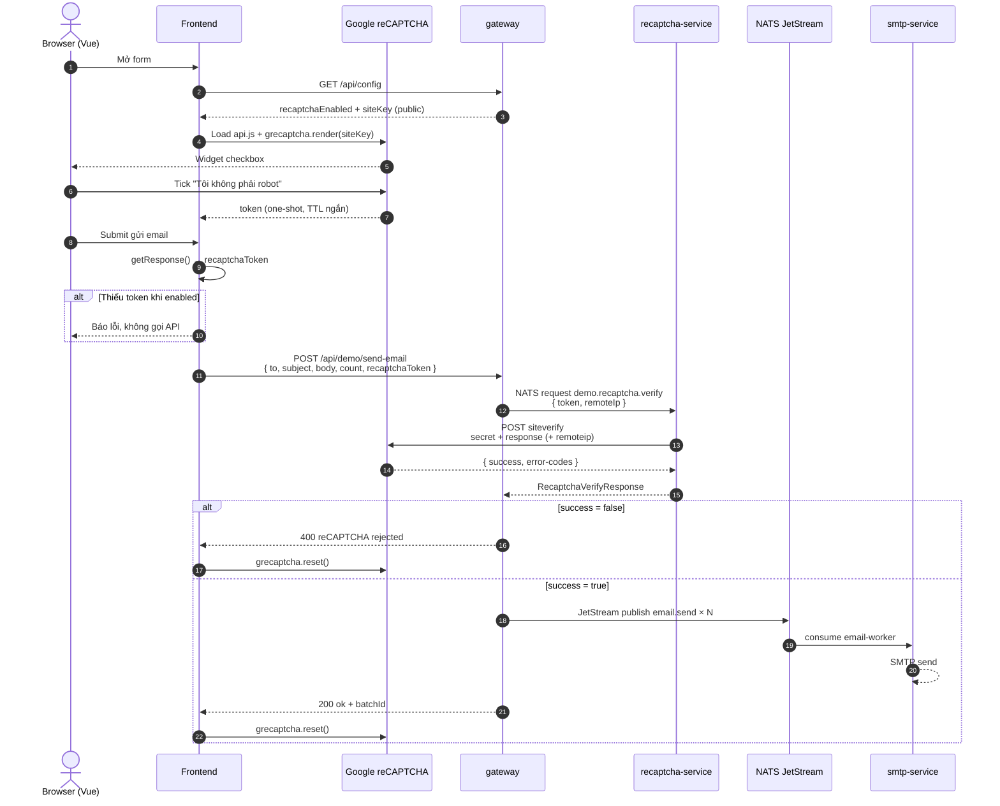

# reCAPTCHA — Lưu ý Frontend & Backend

> Loại dùng trong demo / CMIT-CP: **Google reCAPTCHA v2 Checkbox**.  
> Keys & domain whitelist: xem [RECAPTCHA-CMIT-KEYS.md](./RECAPTCHA-CMIT-KEYS.md).

## Sơ đồ hoạt động




### Luồng tóm tắt


| Bước | Ai                | Việc                                                                  |
| ---- | ----------------- | --------------------------------------------------------------------- |
| 1    | FE                | Lấy `siteKey` từ gateway (`/api/config`) — **không** hard-code secret |
| 2    | FE                | Render widget bằng **Site key** (public)                              |
| 3    | User              | Tick captcha → Google cấp **token**                                   |
| 4    | FE                | Gửi token kèm payload nghiệp vụ lên gateway                           |
| 5    | gateway           | Forward verify qua NATS → `recaptcha-service`                         |
| 6    | recaptcha-service | Gọi Google `siteverify` với **Secret key** (private)                  |
| 7    | gateway           | Chỉ publish mail khi `success=true`                                   |
| 8    | FE                | `grecaptcha.reset()` sau mỗi lần submit (token one-shot)              |


```
┌─────────────┐     siteKey (public)      ┌──────────────┐
│  Frontend   │◄──────────────────────────│   gateway    │
│  (browser)  │                           │  /api/config │
└──────┬──────┘                           └──────┬───────┘
       │ token                                   │ NATS request
       │                                         ▼
       │                                  ┌──────────────────┐
       │                                  │ recaptcha-service│
       │                                  │  SECRET (server) │
       │                                  └────────┬─────────┘
       │                                           │ siteverify
       ▼                                           ▼
┌─────────────┐                            ┌──────────────┐
│ Google JS   │                            │ Google API   │
│ api.js      │                            │ siteverify   │
└─────────────┘                            └──────────────┘
```

---


## Frontend — việc cần lưu ý


### 1. Site key ≠ Secret key


| Key                    | Ở đâu                             | Được lộ?                                              |
| ---------------------- | --------------------------------- | ----------------------------------------------------- |
| `RECAPTCHA_SITE_KEY`   | Browser / Blazor / Vue            | Có (cố ý public)                                      |
| `RECAPTCHA_SECRET_KEY` | Chỉ backend (`recaptcha-service`) | **Không** — không đưa vào bundle FE, HTML, mobile app |


### 2. Domain whitelist (lỗi hay gặp)

Trên [Google Admin](https://www.google.com/recaptcha/admin) phải khớp **hostname browser thật sự**:


| Môi trường  | Ví dụ host cần whitelist                              |
| ----------- | ----------------------------------------------------- |
| Dev         | `localhost`, `127.0.0.1`                              |
| Dev port lạ | Vẫn chỉ cần hostname (port không nằm trong whitelist) |
| UAT/Prod    | Host NGINX/ARR (portal, apicenter, …)                 |


Thiếu domain → widget: `Invalid domain for site key`.

### 3. Load script & render

- Dùng `api.js?render=explicit` rồi `grecaptcha.render(el, { sitekey })` — tránh render 2 lần cùng container.
- Chờ `grecaptcha.ready` trước khi `render`.
- Theme / `hl=vi` chỉ ảnh hưởng UI, không ảnh hưởng verify.


### 4. Token one-shot

- Token **dùng một lần**; TTL ngắn (~2 phút).
- Sau submit (OK hoặc fail verify): luôn `grecaptcha.reset(widgetId)`.
- Không cache token để gửi lại / retry mù quáng → `timeout-or-duplicate`.


### 5. Validate trước khi gọi API

```text
if (recaptchaEnabled && siteKey && !token) → chặn submit ở FE
```

Vẫn **bắt buộc** verify lại ở backend (FE có thể bị bypass).

### 6. Config từ backend

- FE đọc `GET /api/config` → `recaptchaEnabled`, `siteKey`.
- Không tin response lỗi proxy (`{ ok:false, error }`) như config tắt captcha.
- Khi gateway down: báo lỗi nối mạng, **không** giả lập “reCAPTCHA tắt”.


### 7. CORS / same-origin

- Demo DMZ: FE proxy `/api/*` → gateway (same-origin) — tránh CORS.
- Nếu FE gọi thẳng gateway cross-origin: gateway phải CORS đúng origin + không lộ secret.

---


## Backend — việc cần lưu ý


### 1. Chỉ verify bằng Secret trên server

- `recaptcha-service` gọi  
`POST https://www.google.com/recaptcha/api/siteverify`  
body: `secret` + `response` (+ `remoteip` nếu có).
- Gateway **không** giữ secret; chỉ `nats.request` verify rồi quyết định publish.


### 2. `RECAPTCHA_ENABLED` / thiếu secret

Hành vi demo (giống CMIT-CP):


| Điều kiện                               | Kết quả                                |
| --------------------------------------- | -------------------------------------- |
| `ENABLED=false` hoặc secret rỗng        | Verify **skip** → `success=true` (dev) |
| `ENABLED=true` + có secret + token rỗng | `missing-input-response` → **reject**  |
| Google trả `success=false`              | Gateway **400**, không publish mail    |


**Production:** `RECAPTCHA_ENABLED=true` + secret bắt buộc; deploy guard nếu thiếu key.

### 3. `remoteip`

- Gateway lấy từ `X-Forwarded-For` (proxy) hoặc `socket.remoteAddress`.
- Sau NGINX/ARR: cấu hình forward IP đúng — sai IP có thể làm Google khó score (v2 checkbox ít phụ thuộc hơn v3).


### 4. Timeout & lỗi mạng tới Google

- NATS request verify có timeout (demo ~8s).
- `siteverify` fail HTTP/network → trả `success=false` (fail closed), **không** gửi mail.


### 5. Error codes thường gặp


| `error-codes`                                   | Ý nghĩa                   | Hướng xử lý                 |
| ----------------------------------------------- | ------------------------- | --------------------------- |
| `missing-input-secret` / `invalid-input-secret` | Sai/thiếu secret          | Kiểm tra env CI             |
| `missing-input-response`                        | FE không gửi token        | Bắt buộc tick + getResponse |
| `invalid-input-response`                        | Token sai/hết hạn/đã dùng | reset widget, user tick lại |
| `timeout-or-duplicate`                          | Dùng lại token / quá hạn  | reset + tick mới            |
| `bad-request`                                   | Payload siteverify lỗi    | Kiểm tra form-urlencoded    |


### 6. Không verify ở gateway bằng cách “tin FE”

- Mọi API nhạy cảm (login, OTP, gửi mail, đổi MK) đều phải qua verify server-side.
- Captcha **không** thay thế auth / rate-limit / CSRF.


### 7. Windows container / env rỗng

- Env `RECAPTCHA_SECRET_KEY=` (chuỗi rỗng) trên Windows đôi khi bị “nuốt” → coi như thiếu secret → **skip** nếu không cẩn thận.
- Production: đảm bảo secret thật sự được inject; log `hasSecret=true` lúc boot (không log giá trị secret).


### 8. Observability

- Jaeger: span `nats.request demo.recaptcha.verify` + attribute `recaptcha.success`.
- Log: `verified success=… errors=…` — đủ để debug, không log raw token/secret.

---


## Checklist nhanh

**Frontend**

- [ ] Chỉ dùng Site key
- [ ] Domain whitelist đủ host
- [ ] `render` một lần; `reset` sau mỗi submit
- [ ] Không submit khi thiếu token (nếu enabled)
- [ ] Config từ `/api/config`, xử lý lỗi gateway đúng

**Backend**

- [ ] Secret chỉ ở `recaptcha-service`
- [ ] Prod: enabled + secret bắt buộc
- [ ] Fail closed khi Google/NATS lỗi
- [ ] Map `error-codes` ra message FE rõ ràng
- [ ] Publish nghiệp vụ **sau** verify OK

---


## File liên quan (repo này)


| Thành phần            | Path                                                |
| --------------------- | --------------------------------------------------- |
| FE widget             | `frontend/index.html`                               |
| Gateway config + send | `backend/gateway/src/index.ts`                      |
| Verify service        | `backend/recaptcha-service/src/ReCaptchaService.ts` |
| Keys CMIT             | `docs/RECAPTCHA-CMIT-KEYS.md`                       |
| Plan tổng             | `docs/RECAPTCHA-SMTP-NATS-POSTGRES-PLAN.md`         |


